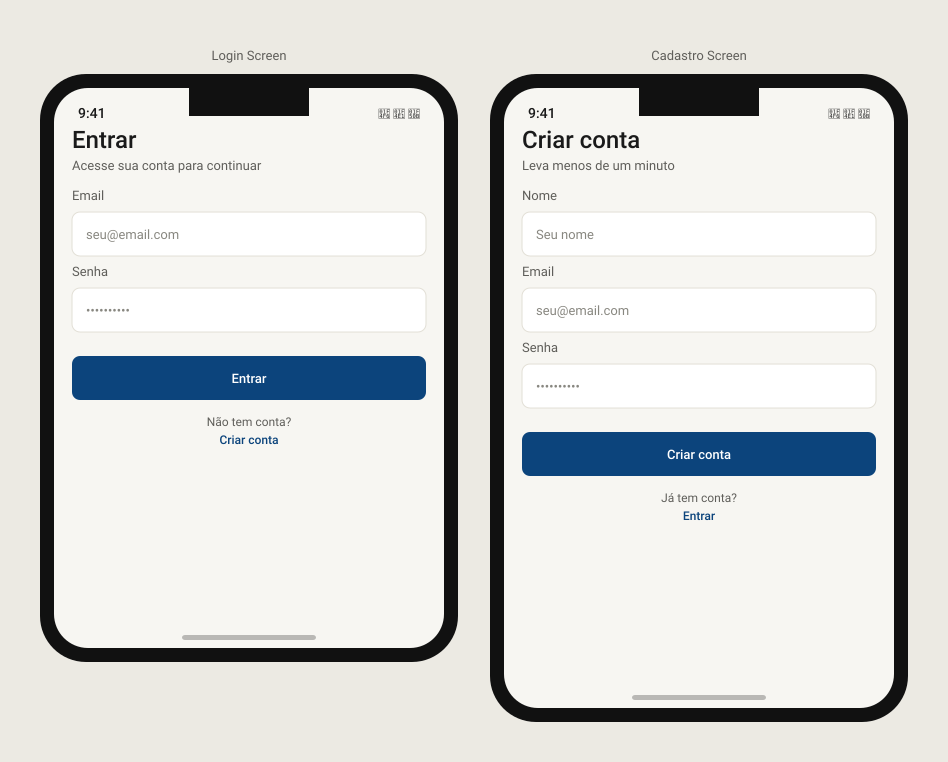

# stockapp-auth

Kotlin Multiplatform (KMP) + Compose Multiplatform module of [StockApp](https://github.com/dgbarreto/stockapp-app) — an investment tracking app (learning project).

Domain + data (client for [`stockapp-backend`](https://github.com/dgbarreto/stockapp-backend), `/auth` endpoints) and Compose login/sign-up screens.

## Screens



## Structure

- `auth/` — the only module in this repo, targeting Android (via `com.android.kotlin.multiplatform.library`) + iOS (static framework `Auth`), shared code in `auth/src/commonMain`.
- `sample/` + `sample-android/` — dev-only sample apps (Android + Desktop) used to validate the module in isolation.

## What's in it

- **Domain**: `AuthRepository` (`isLoggedIn: Flow<Boolean>`, `login`, `register`, `logout`).
- **Data**: `AuthApiClient` (Ktor), `TokenStorage` (JWT persisted across sessions via `multiplatform-settings`), `AuthRepositoryImpl`.
- **Presentation**: `LoginScreen`/`RegisterScreen` + `LoginViewModel`/`RegisterViewModel`, built with `stockapp-designsystem` components (`StockAppTextField`, `StockAppPrimaryButton`, `StockAppErrorBanner`).

## Status

Fully implemented and validated end-to-end against the backend (register → login → logout). Published to GitHub Packages, branch-protected. Consumed by `stockapp-app`, which builds a single shared `HttpClient` (Ktor `Auth`/`bearer` plugin reading from `TokenStorage`) so every other module gets the JWT attached automatically without depending on `auth` directly.

## Stack

- Kotlin 2.4.0 · Compose Multiplatform 1.11.1 · AGP 9.0.1 · Ktor Client · multiplatform-settings

## Running

```
./gradlew :auth:build
./gradlew :auth:testAndroidHostTest
./gradlew :auth:iosSimulatorArm64Test
```

---

_Progress kept up to date manually as the project moves forward._
